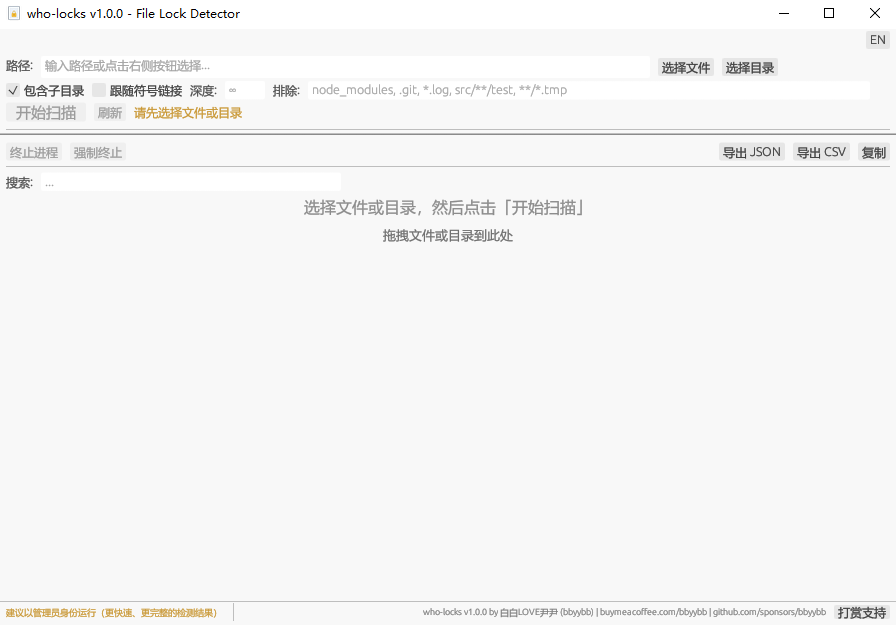
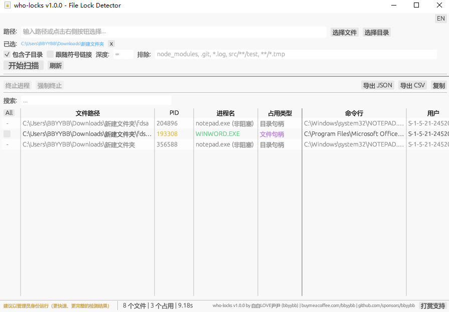

# who-locks

[](LICENSE)
[](https://www.rust-lang.org/)
[](https://github.com/BBYYBB/who-locks/actions)
[](https://github.com/BBYYBB/who-locks/releases)
[](https://github.com/BBYYBB/who-locks/stargazers)

**中文** | [English](README_EN.md)

**Author:** 白白LOVE尹尹 (bbyybb) | **License:** MIT

跨平台文件占用检测工具 — 图形界面 + 命令行，快速找出哪些进程占用了你的文件或目录。

支持 **Windows**、**Linux**、**macOS** 三大平台，支持**中英文界面切换**。

<!-- 主截图 -->
<p align="center">
  
</p>

## 功能

- 图形界面（GUI），双击即可运行；同时支持 **命令行（CLI）模式**，方便脚本集成
- 支持选择文件和目录（原生系统对话框），支持多路径同时扫描
- 支持拖拽文件或目录到窗口中
- 显示占用进程的 PID、进程名、占用类型、命令行、用户
- 搜索过滤：按进程名、PID、路径等快速筛选
- 一键终止占用进程（普通终止 / 强制终止），带确认对话框；Windows 优雅终止通过 WM_CLOSE 发送关闭请求
- **终止进程后自动重新扫描**，验证文件锁是否已释放
- 导出扫描结果为 JSON 或 CSV 文件（均含 UTF-8 BOM，Excel 友好，CSV 含注入防护）
- 实时扫描进度显示，后台线程扫描不卡界面，支持随时取消扫描
- 扫描错误详情弹窗：点击底栏错误数量可查看完整错误列表
- 中英文界面一键切换（占用类型等全面国际化），**自动检测系统语言**
- 一键复制扫描结果到剪贴板（支持选中行或全部可见行，Tab 分隔格式）
- DPI 自适应缩放，自动匹配系统显示设置
- 打赏支持按钮（打开浏览器跳转）
- 目录递归扫描，支持深度限制、排除模式（支持 `*`、`?` 和 `**` 通配符，Windows 下大小写不敏感）和跟随符号链接
- Windows 首次运行自动下载 Sysinternals Handle 工具（下载后自动验证数字签名和哈希）
- 日志系统（通过 RUST_LOG 环境变量控制输出级别）

## 检测覆盖

| 占用类型       | Windows         | Linux               | macOS        |
|---------------|-----------------|----------------------|--------------|
| 文件句柄 (fd)  | Restart Manager | /proc/pid/fd         | lsof         |
| 目录句柄       | handle.exe      | /proc/pid/fd         | lsof         |
| 工作目录 (cwd) | handle.exe      | /proc/pid/cwd        | lsof (cwd)   |
| 可执行文件 (exe)| handle.exe     | /proc/pid/exe        | lsof (txt)   |
| 内存映射 (mmap)| handle.exe      | /proc/pid/map_files  | lsof (mem)   |
| 文件锁 (flock) | Restart Manager | /proc/locks          | lsof         |
| Section 映射   | handle.exe      | N/A                  | N/A          |

## 安装

### 方式一：直接下载（推荐）

从 [Releases](https://github.com/BBYYBB/who-locks/releases) 页面下载对应平台的压缩包：

| 平台 | 文件 |
|------|------|
| Windows (x86_64) | `who-locks-windows-x86_64-vX.X.X.zip` |
| Linux (x86_64) | `who-locks-linux-x86_64-vX.X.X.tar.gz` |
| Linux (aarch64 / ARM64) | `who-locks-linux-aarch64-vX.X.X.tar.gz` |
| macOS (Intel) | `who-locks-macos-x86_64-vX.X.X.tar.gz` |
| macOS (Apple Silicon M1/M2/M3/M4) | `who-locks-macos-aarch64-vX.X.X.tar.gz` |

**Windows**: 解压后双击 `who-locks.exe` 即可打开图形界面。

**macOS**: 解压后直接双击即可运行，无需 `chmod +x`。首次运行时系统可能会弹出 "无法验证开发者" 的提示，此时前往 **系统设置 → 隐私与安全性**，找到被拦截的应用，点击 **"仍要打开"** 即可。

```bash
./who-locks            # 终端运行：启动图形界面
./who-locks /path/to   # 终端运行：命令行模式扫描
```

**Linux**: 解压后赋予执行权限，双击或终端运行：
```bash
chmod +x who-locks
./who-locks            # 启动图形界面
./who-locks /path/to   # 命令行模式扫描
```

> 无需安装 Rust 或任何其他依赖，解压即用。

### 方式二：从源码编译（开发者）

需要 [Rust](https://rustup.rs/) 1.74+ 工具链。

```bash
git clone https://github.com/BBYYBB/who-locks.git
cd who-locks
cargo build --release
# 产物: target/release/who-locks.exe (Windows) 或 target/release/who-locks (Unix)
```

### Windows 额外说明

首次运行时，工具会自动从 Sysinternals Live 下载 `handle64.exe`，并通过 **Authenticode 数字签名** 和 **SHA-256 哈希** 双重验证确保安全。如果网络不可用，可手动从 [Sysinternals Handle](https://learn.microsoft.com/sysinternals/downloads/handle) 下载并放在同目录下。

## 使用方法

### GUI 图形界面

1. **双击运行** `who-locks.exe`（Windows）或 `who-locks`（macOS，首次需在隐私设置中允许）或 `./who-locks`（Linux），打开图形界面
2. 点击 **「选择文件」** 或 **「选择目录」** 按钮，选择要检测的路径（支持多选）
3. 设置扫描选项（子目录、深度限制、排除模式支持 `*`、`?` 和 `**` 通配符、跟随符号链接）
4. 点击 **「开始扫描」**，等待扫描完成
5. 在结果表格中查看占用详情，使用搜索框过滤
6. 勾选要处理的进程，点击 **「终止进程」** 或 **「强制终止」**（终止后自动重新扫描验证）
7. 点击 **「导出 JSON」** 或 **「导出 CSV」** 保存结果

右上角可以切换 **中文 / English** 界面语言。

### CLI 命令行模式

传入路径参数即可进入命令行模式（无参数时启动 GUI）：

```bash
# 扫描单个文件
who-locks C:\path\to\file.txt

# 扫描目录，排除 node_modules 和所有 .log 文件
who-locks C:\project -e "node_modules,*.log"

# JSON 格式输出
who-locks C:\project -f json

# 限制扫描深度为 3 层
who-locks C:\project -d 3

# 不递归子目录
who-locks C:\project -n
```

CLI 选项：

| 选项 | 说明 |
|------|------|
| `<PATHS>` | 要扫描的文件或目录路径（必填，支持多个） |
| `-n, --no-recursive` | 不递归扫描子目录 |
| `-d, --depth <N>` | 最大扫描深度 |
| `-e, --exclude <PATTERNS>` | 排除模式，逗号分隔，支持 `*`、`?` 和 `**` 通配符 |
| `-f, --format <FORMAT>` | 输出格式：`text`（默认）或 `json` |

<!-- 截图：扫描结果 -->
<p align="center">
  
</p>

## 平台检测引擎

### Windows

- **Restart Manager API**：微软官方文件占用检测接口，批量预筛选优化，6000+ 文件约 2 秒
- **Sysinternals Handle**（首次自动下载）：深度句柄扫描，检测目录句柄、Section 映射等
- **PowerShell WMI**（后备）：当 handle.exe 不可用时使用

建议以**管理员权限**运行以获得完整结果。

### Linux

- 通过 `/proc` 文件系统一次遍历所有进程，使用反转索引优化
- 检测 fd、cwd、exe、mmap (map_files)、flock (/proc/locks) 五种占用类型
- 目录级深度扫描：通过路径前缀匹配直接定位占用，无需预先枚举目录文件

建议以 **root/sudo** 运行。

### macOS

- 调用 `lsof -F` 机器可解析格式，自动识别 fd 类型（cwd/txt/mem 等）
- 目录级深度扫描：通过 `lsof +D` 一次递归获取所有被打开的文件

建议以 **sudo** 运行。

## 项目结构

```
assets/
├── icon.svg             # 应用图标 SVG 源文件
├── icon.png             # 256x256 PNG（运行时窗口图标）
└── icon.ico             # 多分辨率 ICO（Windows .exe 内嵌图标）
src/
├── main.rs              # 入口（GUI 或 CLI 模式）
├── cli.rs               # CLI 命令行模式
├── model.rs             # 数据模型 (ProcessInfo, FileLockInfo, LockType)
├── error.rs             # 错误类型
├── scan.rs              # 扫描协调器 + 进度回调
├── res.rs               # 资源完整性校验
├── sha256_impl.rs       # SHA-256 共享实现（build.rs 和 res.rs 共用）
├── gui/
│   ├── mod.rs           # eframe App 主循环
│   ├── state.rs         # GUI 状态机
│   ├── panels.rs        # 界面面板（工具栏、表格、底栏、对话框）
│   ├── worker.rs        # 后台扫描/终止线程
│   ├── export.rs        # JSON/CSV 导出
│   └── i18n.rs          # 中英文国际化 + 字体加载
├── detector/
│   ├── mod.rs           # LockDetector trait
│   ├── windows.rs       # Windows: Restart Manager + handle.exe
│   ├── linux.rs         # Linux: /proc (fd/cwd/exe/mmap/flock)
│   └── macos.rs         # macOS: lsof
└── killer/
    ├── mod.rs           # ProcessKiller trait
    ├── windows.rs       # WM_CLOSE / TerminateProcess
    └── unix.rs          # SIGTERM/SIGKILL
tests/
└── cli_integration.rs   # CLI 端到端集成测试
build.rs                 # 编译时完整性校验 + 签名注入 + Windows 图标嵌入
```

## 已知限制

- **Windows 非管理员**：非管理员身份运行时，无法检测到其他用户的进程占用；建议以管理员权限运行以获得完整结果
- **handle.exe 与中文路径**：Sysinternals handle.exe 通过管道输出时，可能无法正确编码中文等非 ASCII 路径字符。工具会尝试通过文件系统匹配还原真实路径，但当目录下存在多个相似扩展名的文件时可能无法精确还原
- **PowerShell WMI 回退精度**：当 handle.exe 不可用时，工具回退到 PowerShell WMI 查询，仅能检测到命令行中引用了目标路径的进程，精度有限
- **macOS/Linux lsof 权限**：非 root/sudo 用户只能检测到自己进程的文件占用
- **WM_CLOSE 优雅终止**：Windows 优雅终止通过 WM_CLOSE 发送关闭请求，如果目标进程弹出保存对话框，需要用户手动处理后进程才会退出；此时可使用「强制终止」

## CLI 输出示例

### 文本格式（默认）

```
C:\project\data.db
  PID: 1234  Process: app.exe  Type: File Handle
    Command: "C:\Program Files\App\app.exe" --data C:\project\data.db
    User: DESKTOP-ABC\user
  PID: 5678  Process: backup.exe  Type: File Lock
    Command: backup.exe C:\project\
    User: DESKTOP-ABC\user

C:\project\config.json
  PID: 1234  Process: app.exe  Type: File Handle (non-blocking)
    Command: "C:\Program Files\App\app.exe" --data C:\project\data.db
    User: DESKTOP-ABC\user

2 locked file(s), 2 blocking process(es) (150 files scanned)
```

无占用时输出：
```
No locked files found. (150 files scanned)
```

### JSON 格式

```bash
who-locks C:\project -f json
```

```json
[
  {
    "file_path": "C:\\project\\data.db",
    "pid": 1234,
    "process_name": "app.exe",
    "lock_type": "File Handle",
    "command_line": "\"C:\\Program Files\\App\\app.exe\" --data C:\\project\\data.db",
    "user": "DESKTOP-ABC\\user",
    "blocking": true
  },
  {
    "file_path": "C:\\project\\data.db",
    "pid": 5678,
    "process_name": "backup.exe",
    "lock_type": "File Lock",
    "command_line": "backup.exe C:\\project\\",
    "user": "DESKTOP-ABC\\user",
    "blocking": true
  }
]
```

> JSON 输出适合脚本集成和自动化处理，每条记录包含 `blocking` 字段指示该占用是否阻塞文件操作。

## 排除模式语法

`-e` / `--exclude` 选项和 GUI 中的排除输入框支持以下通配符：

| 通配符 | 说明 | 示例 |
|--------|------|------|
| `*` | 匹配任意数量的字符（不跨目录） | `*.log` 匹配 `error.log`，不匹配 `logs/error.log` |
| `?` | 匹配单个字符 | `data?.db` 匹配 `data1.db`、`dataA.db` |
| `**` | 匹配任意层级的目录 | `**/test` 匹配 `src/test`、`src/a/b/test` |

多个模式用逗号分隔：

```bash
who-locks C:\project -e "node_modules, .git, *.log, **/test, **/*.tmp"
```

> Windows 上排除模式大小写不敏感（`*.LOG` 和 `*.log` 等效），Linux / macOS 上大小写敏感。

## 环境变量

| 变量 | 说明 | 示例 |
|------|------|------|
| `RUST_LOG` | 控制日志输出级别 | `RUST_LOG=debug who-locks C:\path` |

支持的日志级别（从详细到精简）：`trace` > `debug` > `info` > `warn` > `error`

```bash
# 查看详细调试信息（推荐排查问题时使用）
RUST_LOG=debug who-locks /path/to/scan

# 仅显示警告和错误
RUST_LOG=warn who-locks /path/to/scan

# Windows CMD
set RUST_LOG=debug && who-locks C:\path

# Windows PowerShell
$env:RUST_LOG="debug"; who-locks C:\path
```

## CLI 退出码

| 退出码 | 说明 |
|--------|------|
| `0` | 扫描成功完成（无论是否发现占用） |
| `1` | 存在错误（如路径不存在） |

## 常见问题

### 扫描结果不完整，看不到某些进程？

需要以**管理员 / root / sudo** 权限运行。非提权运行时，操作系统限制只能检测到当前用户自己的进程占用。

- **Windows**：右键 `who-locks.exe` → **以管理员身份运行**
- **Linux**：`sudo ./who-locks /path/to/scan`
- **macOS**：`sudo ./who-locks /path/to/scan`

### Windows 上 handle.exe 下载失败？

首次运行时工具会自动从 Sysinternals Live 下载 `handle64.exe`。如果网络不可用或下载失败：

1. 手动从 [Sysinternals Handle](https://learn.microsoft.com/sysinternals/downloads/handle) 下载
2. 解压得到 `handle64.exe`
3. 将 `handle64.exe` 放在 `who-locks.exe` **同目录**下
4. 重新运行即可

> 即使没有 handle.exe，工具仍可通过 Restart Manager API 检测文件句柄和文件锁。handle.exe 提供额外的目录句柄、Section 映射等深度检测能力。

### Linux 上中文界面显示方块或乱码？

GUI 模式需要系统安装 CJK 字体。根据发行版安装：

```bash
# Ubuntu / Debian
sudo apt install fonts-noto-cjk

# Fedora / RHEL
sudo dnf install google-noto-sans-cjk-fonts

# Arch Linux
sudo pacman -S noto-fonts-cjk
```

安装后重新启动 who-locks 即可。

### macOS 提示"无法验证开发者"？

首次运行时 macOS 可能阻止未签名应用：

1. 前往 **系统设置 → 隐私与安全性**
2. 找到被拦截的 who-locks，点击 **"仍要打开"**
3. 之后可正常使用

### "No locked files found" 但文件仍然无法删除 / 移动？

可能的原因：
- 未以管理员权限运行，看不到其他用户的进程
- 占用进程已退出但文件系统缓存未刷新，稍等片刻后重试
- 防病毒软件实时扫描占用（此类占用通常为瞬时的，可尝试暂时排除该目录）
- 网络驱动器 / SMB 共享上的远程锁定（工具仅检测本地进程占用）

### 如何在脚本中使用？

使用 CLI 模式配合 JSON 输出：

```bash
# 检查文件是否被占用，利用 JSON 输出配合 jq 处理
result=$(who-locks /path/to/file -f json)
if [ "$result" != "[]" ]; then
    echo "File is locked!"
    echo "$result" | jq '.[].process_name'
fi
```

## 支持作者

如果这个工具对你有帮助，欢迎请作者喝杯咖啡 :)

| 微信支付 | 支付宝 | Buy Me a Coffee |
|:--------:|:------:|:---------------:|
|  |  | <a href="https://www.buymeacoffee.com/bbyybb"></a> |

[buymeacoffee.com/bbyybb](https://www.buymeacoffee.com/bbyybb) | [GitHub Sponsors](https://github.com/sponsors/bbyybb/)

## 许可证

MIT
