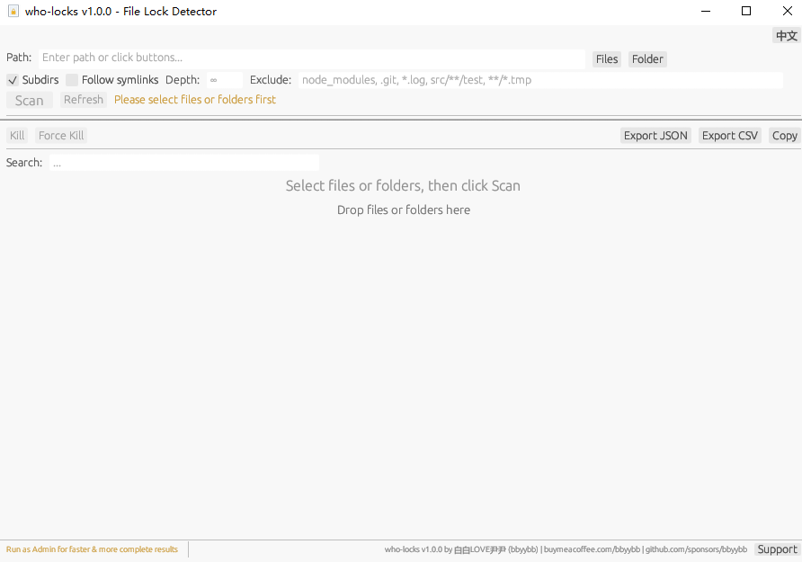
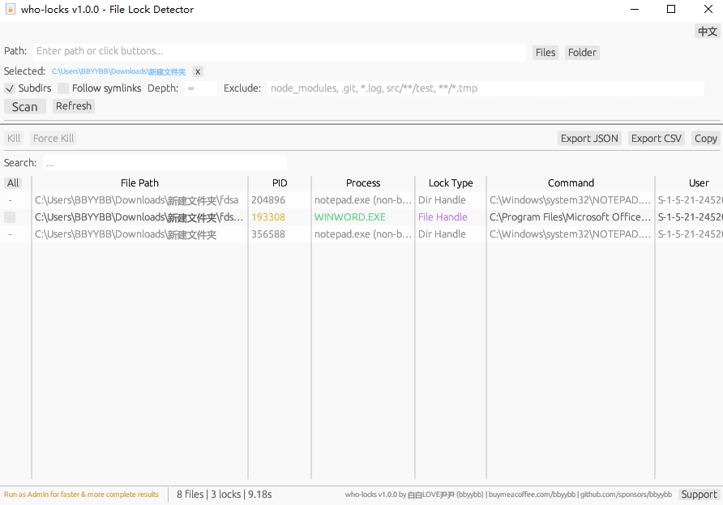

# who-locks

[](LICENSE)
[](https://www.rust-lang.org/)
[](https://github.com/BBYYBB/who-locks/actions)
[](https://github.com/BBYYBB/who-locks/releases)
[](https://github.com/BBYYBB/who-locks/stargazers)

[中文](README.md) | **English**

**Author:** bbyybb | **License:** MIT

Cross-platform file lock detector with GUI & CLI — find out which processes are locking your files or directories.

Supports **Windows**, **Linux**, and **macOS** with **Chinese/English** interface.

<!-- Main screenshot -->
<p align="center">
  
</p>

## Features

- Graphical User Interface (GUI) — double-click to run; also supports **CLI mode** for scripting
- Native file/folder picker dialog, supports multiple paths
- Drag and drop files or folders into the window
- Shows PID, process name, lock type, command line, user
- Search filter by process name, PID, path
- Kill locking processes (normal / force) with confirmation dialog; Windows graceful kill sends WM_CLOSE
- **Auto re-scan after kill** to verify file locks are released
- Export results to JSON or CSV (both with UTF-8 BOM, Excel-friendly, CSV injection protected)
- Real-time scan progress, background thread scanning, cancel scan at any time
- Error details dialog: click error count in footer to view full error list
- Chinese / English interface toggle (fully localized lock types), **auto-detects system language**
- Copy scan results to clipboard (selected or all visible rows, tab-separated format)
- DPI-adaptive scaling, automatically matches system display settings
- Donation/support button (opens browser)
- Recursive directory scan with depth limit, exclusion patterns (supports `*`, `?` and `**` wildcards, case-insensitive on Windows), and symlink following
- Windows: auto-downloads Sysinternals Handle on first run (verified via digital signature and hash)
- Logging system (set RUST_LOG env var for debug output)

## Detection Coverage

| Lock Type       | Windows         | Linux               | macOS        |
|----------------|-----------------|----------------------|--------------|
| File handle    | Restart Manager | /proc/pid/fd         | lsof         |
| Directory handle | handle.exe    | /proc/pid/fd         | lsof         |
| Working dir (cwd) | handle.exe   | /proc/pid/cwd        | lsof (cwd)   |
| Executable (exe) | handle.exe    | /proc/pid/exe        | lsof (txt)   |
| Memory map (mmap) | handle.exe   | /proc/pid/map_files  | lsof (mem)   |
| File lock (flock) | Restart Manager | /proc/locks        | lsof         |
| Section mapping | handle.exe     | N/A                  | N/A          |

## Installation

### Option 1: Download Pre-built Binary (Recommended)

Download from [Releases](https://github.com/BBYYBB/who-locks/releases):

| Platform | File |
|----------|------|
| Windows (x86_64) | `who-locks-windows-x86_64-vX.X.X.zip` |
| Linux (x86_64) | `who-locks-linux-x86_64-vX.X.X.tar.gz` |
| Linux (aarch64 / ARM64) | `who-locks-linux-aarch64-vX.X.X.tar.gz` |
| macOS (Intel) | `who-locks-macos-x86_64-vX.X.X.tar.gz` |
| macOS (Apple Silicon M1/M2/M3/M4) | `who-locks-macos-aarch64-vX.X.X.tar.gz` |

**Windows**: Extract and double-click `who-locks.exe`.

**macOS / Linux**: Extract, make executable, then run:
```bash
chmod +x who-locks
./who-locks            # Launch GUI
./who-locks /path/to   # CLI mode scan
```

> No Rust or other dependencies required. Just extract and run.

### Option 2: Build from Source (Developers)

Requires [Rust](https://rustup.rs/) 1.74+.

```bash
git clone https://github.com/BBYYBB/who-locks.git
cd who-locks
cargo build --release
# Output: target/release/who-locks.exe (Windows) or target/release/who-locks (Unix)
```

### Windows Note

On first run, the tool auto-downloads `handle64.exe` from Sysinternals Live, verified via **Authenticode digital signature** and **SHA-256 hash** for security. If unavailable, download from [Sysinternals Handle](https://learn.microsoft.com/sysinternals/downloads/handle).

## Usage

### GUI Mode

1. **Double-click** `who-locks.exe` (Windows) or `./who-locks` (macOS/Linux)
2. Click **"Files"** or **"Folder"** to select paths (multi-select supported)
3. Configure scan options (subdirs, depth, exclusion patterns with `*`, `?` and `**` wildcards, follow symlinks)
4. Click **"Scan"** and wait for results
5. View results in the table, use search to filter
6. Select processes and click **"Kill"** or **"Force Kill"** (auto re-scans after kill to verify)
7. Click **"Export JSON"** or **"Export CSV"** to save results

Toggle **中文 / EN** in the top-right corner.

### CLI Mode

Pass path arguments to enter CLI mode (no arguments launches GUI):

```bash
# Scan a single file
who-locks C:\path\to\file.txt

# Scan directory, exclude node_modules and all .log files
who-locks C:\project -e "node_modules,*.log"

# JSON output
who-locks C:\project -f json

# Limit scan depth to 3
who-locks C:\project -d 3

# No recursion
who-locks C:\project -n
```

CLI options:

| Option | Description |
|--------|-------------|
| `<PATHS>` | File or directory paths to scan (required, multiple allowed) |
| `-n, --no-recursive` | Do not recurse into subdirectories |
| `-d, --depth <N>` | Maximum scan depth |
| `-e, --exclude <PATTERNS>` | Exclude patterns, comma-separated, supports `*`, `?` and `**` wildcards |
| `-f, --format <FORMAT>` | Output format: `text` (default) or `json` |

<!-- Screenshot: results -->
<p align="center">
  
</p>

## Platform Engines

### Windows
- **Restart Manager API**: Official file lock detection, batch-optimized, ~2s for 6000+ files
- **Sysinternals Handle** (auto-downloaded): Deep handle scan for dirs, Section mappings
- **PowerShell WMI** (fallback)

Run as **Administrator** for complete results.

### Linux
- Single-pass `/proc` traversal with inverted index
- Detects: fd, cwd, exe, mmap, flock
- Directory-level deep scan via path prefix matching

Run as **root/sudo** for complete results.

### macOS
- Uses `lsof -F` with auto fd type detection
- Directory-level deep scan via `lsof +D`

Run as **sudo** for complete results.

## Project Structure

```
assets/
├── icon.svg             # App icon SVG source
├── icon.png             # 256x256 PNG (runtime window icon)
└── icon.ico             # Multi-resolution ICO (Windows .exe embedded icon)
src/
├── main.rs              # Entry point (GUI or CLI mode)
├── cli.rs               # CLI command-line mode
├── model.rs             # Data models (ProcessInfo, FileLockInfo, LockType)
├── error.rs             # Error types
├── scan.rs              # Scan coordinator + progress callback
├── res.rs               # Resource integrity verification
├── sha256_impl.rs       # Shared SHA-256 implementation (used by build.rs and res.rs)
├── gui/
│   ├── mod.rs           # eframe App main loop
│   ├── state.rs         # GUI state machine
│   ├── panels.rs        # UI panels (toolbar, table, footer, dialogs)
│   ├── worker.rs        # Background scan/kill threads
│   ├── export.rs        # JSON/CSV export
│   └── i18n.rs          # Chinese/English i18n + font loading
├── detector/
│   ├── mod.rs           # LockDetector trait
│   ├── windows.rs       # Windows: Restart Manager + handle.exe
│   ├── linux.rs         # Linux: /proc (fd/cwd/exe/mmap/flock)
│   └── macos.rs         # macOS: lsof
└── killer/
    ├── mod.rs           # ProcessKiller trait
    ├── windows.rs       # WM_CLOSE / TerminateProcess
    └── unix.rs          # SIGTERM/SIGKILL
```

## Known Limitations

- **Windows non-admin**: Running without admin privileges limits visibility to your own processes. Run as Administrator for complete results
- **handle.exe and non-ASCII paths**: Sysinternals handle.exe may garble Chinese/CJK characters in pipe output. The tool attempts to resolve garbled paths via filesystem matching, but may fail when multiple files share similar extensions in the same directory
- **PowerShell WMI fallback**: When handle.exe is unavailable, the tool falls back to PowerShell WMI queries, which can only detect processes that reference the target path in their command line — limited precision
- **macOS/Linux lsof permissions**: Non-root/sudo users can only detect file locks from their own processes
- **WM_CLOSE graceful kill**: Windows graceful kill sends WM_CLOSE, which may trigger a save dialog in the target application. The process won't exit until the user handles the dialog; use Force Kill as an alternative

## Support the Author

If this tool is helpful, consider buying the author a coffee :)

| WeChat Pay | Alipay | Buy Me a Coffee |
|:----------:|:------:|:---------------:|
|  |  | <a href="https://www.buymeacoffee.com/bbyybb"></a> |

[buymeacoffee.com/bbyybb](https://www.buymeacoffee.com/bbyybb) | [GitHub Sponsors](https://github.com/sponsors/bbyybb/)

## License

MIT
